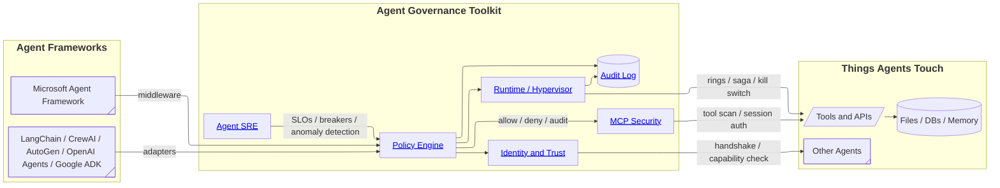

# Ophanix Platform Quickstart

This folder is a guided tour of the Agent Governance Toolkit code in this
repository. The root [QUICKSTART.md](../QUICKSTART.md) is good for getting a
single rule running, but it does not explain how the platform hangs together.
These notes are meant to give you the practical mental model you need before
building Ophanix on top of it.

## Big Picture

The platform is not one monolithic service. It is a set of composable packages
that sit between an agent framework and the actions agents want to take.
Agent frameworks still plan, reason, call tools, and hand work to other agents.
The governance layer asks: "Should this action happen, under this identity,
with this trust score, in this runtime context, and will we be able to prove it
later?"



## Best Reading Order

Start with the interception path, then the trust model, then runtime safety,
then operational governance:

1. [Policy Engine](01-policy-engine.md)
2. [Framework Integrations](02-framework-integrations.md)
3. [MCP Security Gateway and Scanner](03-mcp-security-gateway-and-scanner.md)
4. [Zero-Trust Identity](04-zero-trust-identity.md)
5. [Trust Scoring](05-trust-scoring.md)
6. [Least-Privilege Capabilities](06-least-privilege-capabilities.md)
7. [Privilege Rings](07-privilege-rings.md)
8. [Execution Sandboxing](08-execution-sandboxing.md)
9. [Saga Orchestration](09-saga-orchestration.md)
10. [Kill Switch](10-kill-switch.md)
11. [Audit Logging and Flight Recorder](11-audit-logging-flight-recorder.md)
12. [Prompt Injection Detection](12-prompt-injection-detection.md)
13. [Memory Integrity](13-memory-integrity.md)
14. [Output Validation](14-output-validation.md)
15. [Secure Inter-Agent Communication](15-secure-inter-agent-communication.md)
16. [Rogue Agent Detection](16-rogue-agent-detection.md)
17. [Shadow AI Discovery](17-shadow-ai-discovery.md)
18. [Agent Lifecycle Management](18-agent-lifecycle-management.md)
19. [SLO Engineering](19-slo-engineering.md)
20. [Circuit Breakers](20-circuit-breakers.md)
21. [Chaos Resilience Testing](21-chaos-resilience-testing.md)
22. [Plugin Marketplace](22-plugin-marketplace.md)
23. [Governance Dashboard](23-governance-dashboard.md)
24. [Unified CLI and Compliance Verification](24-unified-cli-and-compliance.md)

## Setup For Local Exploration

From the repository root:

```bash
cd ophanix-platform
python -m venv .venv
source .venv/bin/activate
python3 -m pip install -e packages/agent-os
python3 -m pip install -e packages/agent-mesh
python3 -m pip install -e packages/agent-hypervisor
python3 -m pip install -e packages/agent-runtime
python3 -m pip install -e packages/agent-sre
python3 -m pip install -e packages/agent-compliance
python3 -m pip install -e packages/agent-marketplace
python3 -m pip install -e packages/agent-discovery
```

If you only want the published package experience, quote extras in zsh:

```bash
python3 -m pip install 'agent-governance-toolkit[full]'
```

## Demo Map

The fastest demos are:

```bash
cd ophanix-platform

# No live LLM required for the simple framework walkthroughs unless the script
# itself calls a provider.
python3 examples/quickstart/govern_in_60_seconds.py
python3 examples/quickstart/retrofit_governed.py

# Live governance middleware demo. Requires OPENAI_API_KEY, Azure OpenAI env
# vars, or GOOGLE_API_KEY / GEMINI_API_KEY.
python3 demo/maf_governance_demo.py

# Streamlit dashboard with simulated fleet data.
cd demo/governance-dashboard
pip install -r requirements.txt
streamlit run app.py
```

The docs in this folder include more feature-specific commands. When a feature
has no dedicated demo script, the doc points you to the closest runnable example
or the smallest source file to read.

## Source Of Truth

There are three layers of documentation in this repo:

- [features/](../features/) explains the product-facing feature ideas in
  non-technical, business, and technical forms.
- [docs/tutorials/](../docs/tutorials/) contains longer step-by-step guides.
- [packages/](../packages/) is the authoritative implementation.

When those disagree, trust `packages/` first. Several technical feature docs
describe a target architecture that is broader than the current public-preview
implementation.
